# JD's Battleship

JD's Battleship is a minigame of battleship where the user tries to hit all the ships generated by the computer.
The user has a maximum number of tries to achieve this.

It's a nice time killing minigame based on sheer luck

## Features

### Existing features

- __Opening Message and Difficulty settings__
  - At the beginning of the game, this opening message is shown to the user.
  - Under the message, the game asks the user what difficulty he or she prefers.
  - The difficulty is ranged from 1 to 3, with 1 being the easiest and 3 the hardest difficulty.

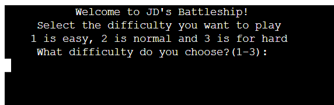

- __Level 1 difficulty:__
  - This difficulty has a grid of 3 x 3.
  - The game generates 2 ships.
  - The user has 5 attempts to hit all ships.

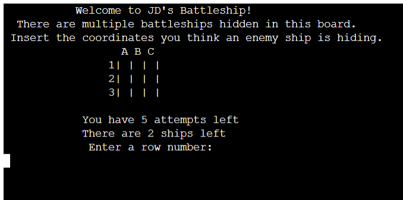

- __Level 2 difficulty:__
  - This difficulty has a grid of 6 x 6.
  - The game generates 8 ships.
  - The user has 20 attempts to hit all ships.

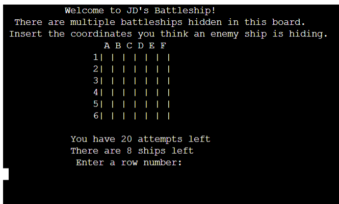

- __Level 3 difficulty:__
  - This difficulty has a grid of 10 x 10.
  - The game generates 16 ships.
  - The user has 40 attempts to hit all ships.

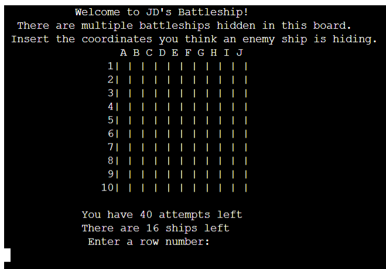

- __Inserting Invalid Coordinates__
  - If the user inserts an invalid difficulty value (anything else than 1, 2 or 3),
  - the program will ask the user to insert a valid difficulty

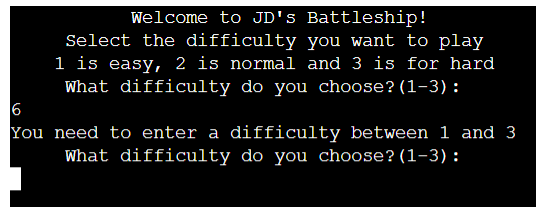

- __Inserting Coordinates__
  - The user is asked to insert coordinates as shown on the grid.
  - These coordinates will be the guess of the user where the ships are hiding.
  - For the column letter input, the user needs to insert a letter.
  - It doesn't matter if it's a lowercase or uppercase letter, but it can't be a number.

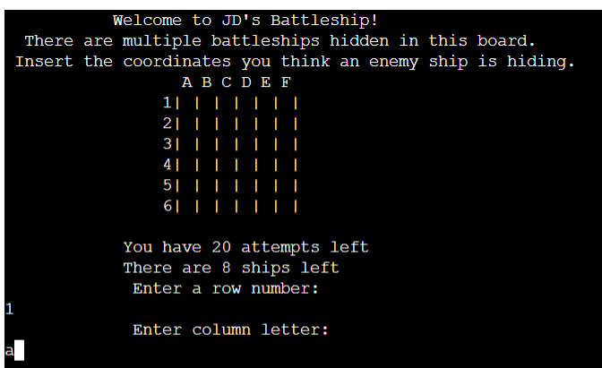

- __Missing the Target(s)__
  - If the coordinates inserted by the user miss a ship, this next message will pop up:

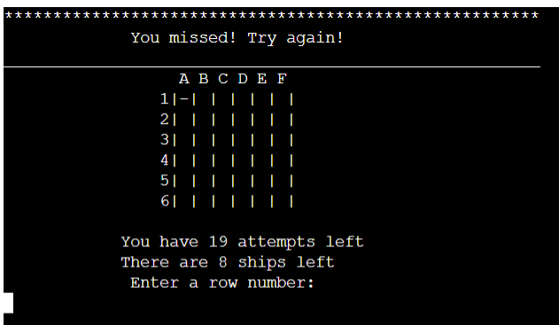

- __Hitting one of the Targets__
  - If the user hits a target, the number of ships left is lowered by one.
  - If the user hits a target, the next message will pop up:

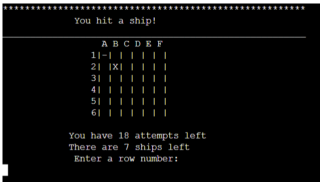

- __Checking for Valid Coordinates__
  - If the user inserts coordinates that don't exist on the shown board, this message will pop up:
  - NOTE: the user will lose an attempt by missing the board!

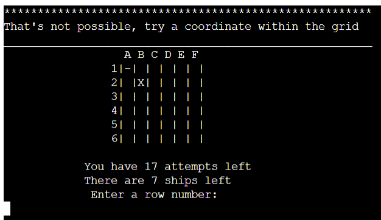

- __Inserting Coordinates Twice__
  - If the user inserts the same coordinates as he or she did earlier in the game, this message will pop up:
  - NOTE: the user will lose an attempt by hitting the same coordinates twice!

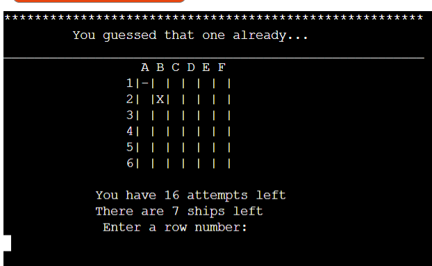

- __Losing the Game__
  - If the user does not manage to hit all the ships with his or her amount of attempts, the user loses.

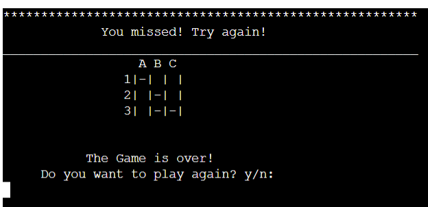

- __Winning the Game__
  - If the user does manage to hit all the ships, he or she wins the game!

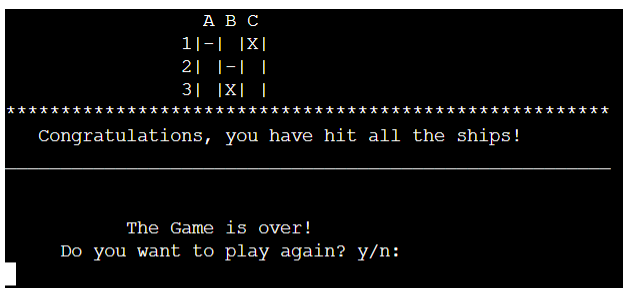

- __Play Again__
  - After the game is over (won or lost), the program will ask the user if he or she wants to play again.
  - The user can answer with "y" for yes and "n" for no.
  - If the user inserts "y" the game will be reset and played again.
  - If the user inserts "n" the program will shut down.

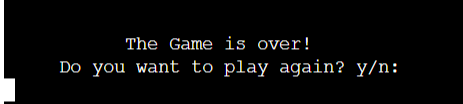

### Future features

- __Longer and Orientated Ships__
  - The original plan was to make multiple classes of ships with various lenghts.
  - I wasn't able to implement it; it kept crashing and giving errors.
  - Most likely due to the fact that I made a list of generated ships that couldn't be accessed by the guessing coordinates list.
  - For difficulty 1 I want one 1x1 ship and one 1x2 ship.
  - For difficulty 2 I want one 1x2 ship, one 1x3 ship and one 1x4 ship.
  - For difficulty 3 I want two 1x2 ships, two 1x3 ships and two 1x4.
  - The coordinate guessing would then be less based on luck, seeing as some hits can be adjacent to each other.
  - The attempts can be less, seeing as it isn't only luck.

- __Give the Computer a Chance to Shoot Back__
  - I want the computer to also shoot back at the user.
  - Right now the game can only end in 2 ways:
    - The user has no attempts left (loses)
    - The user hits all ships (wins)
  
  - If the computer can fight back, it could beat the player in guessing.
  - This way the game can end in a win, a draw, or a loss for the player.

- __A Scoring Board__
  - If the computer can fight back and the game can end in a win, a draw or a loss,
  - we can also implement a scoring board. Counting every win, draw or loss by the player and computer.

## Testing

### Validator and Github errors

- __Validator__
  - The [pep8ci](https://pep8ci.herokuapp.com/) gave no errors in my code.

- __Github errors__
  - I changed the Linter in github after reading a tip in the project-portfolio-3 channel in Slack:
    - Searching "Python: Select Linter" in the Command Palette.
    - Chose the Flake8 linter.
  - This way I didn't get errors for not having uppercase variables.
  - There are no errors or warnings in my run.py file.

### Bugs

#### Fixed Bugs

- Fixed a bug where board_size was called before being referenced.
- Fixed a bug where num_ships was called before being referenced.
- 

#### Unfixed Bugs

- Some ships have the same generated coordinates.
- The game sometimes ends to quickly; before the attempts are less than the amount of ships left.
- The print commands do not line up neat in relation to the board. (not really a bug, more a personal flaw)

## Credits

- Changing the pylint in github [tip](https://code-institute-room.slack.com/archives/C027C3S3TEU/p1631013285037400?thread_ts=1631012358.036500&cid=C027C3S3TEU)

