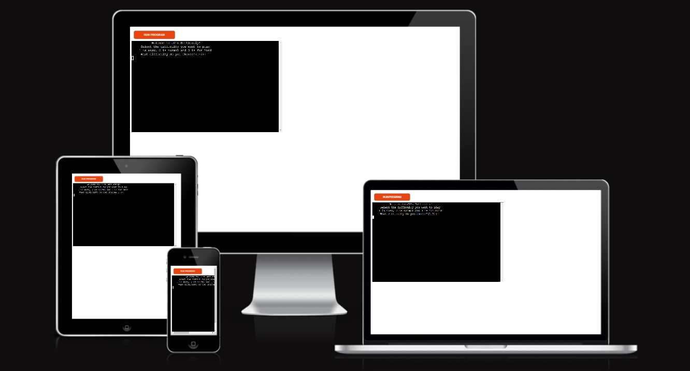

# JD's Battleship

JD's Battleship is a minigame of battleship where the user tries to hit all the ships generated by the computer.
The user has a maximum number of tries to achieve this.

It's a nice time killing minigame based on sheer luck

## How to play

## Features

### Existing features

- __Opening Message and Difficulty settings__
  - At the beginning of the game, this opening message is shown to the user.
  - Under the message, the game asks the user what difficulty he or she prefers.
  - The difficulty is ranged from 1 to 3, with 1 being the easiest and 3 the hardest difficulty.

- __Level 1 difficulty:__
  - This difficulty has a grid of 3 x 3.
  - The game generates 2 ships.
  - The user has 5 attempts to hit all ships.

- __Level 2 difficulty:__
  - This difficulty has a grid of 6 x 6.
  - The game generates 8 ships.
  - The user has 20 attempts to hit all ships.

- __Level 3 difficulty:__
  - This difficulty has a grid of 10 x 10.
  - The game generates 16 ships.
  - The user has 40 attempts to hit all ships.

- __Inserting Invalid Coordinates__
  - If the user inserts an invalid difficulty value (anything else than 1, 2 or 3), 
  - the program will ask the user to insert a valid difficulty

- __Inserting Coordinates__
  - The user is asked to insert coordinates as shown on the grid.
  - These coordinates will be the guess of the user where the ships are hiding.
  - For the column letter input, the user needs to insert a letter.
  - It doesn't matter if it's a lowercase or uppercase letter, but it can't be a number.

- __Missing the Target(s)__
  - If the coordinates inserted by the user miss a ship, this next message will pop up:

- __Hitting one of the Targets__
  - If the user hits a target, the number of ships left is lowered by one.
  - If the user hits a target, the next message will pop up:

- __Checking for Valid Coordinates__
  - If the user inserts coordinates that don't exist on the shown board, this message will pop up:
  - NOTE: the user will lose an attempt by missing the board!

- __Inserting Coordinates Twice__
  - If the user inserts the same coordinates as he or she did earlier in the game, this message will pop up:
  - NOTE: the user will lose an attempt by hitting the same coordinates twice!

- __Losing the Game__
  - If the user does not manage to hit all the ships with his or her amount of attempts, the user loses.

- __Winning the Game__
  - If the user does manage to hit all the ships, he or she wins the game!

- __Play Again__
  - After the game is over (won or lost), the program will ask the user if he or she wants to play again.
  - The user can answer with "y" for yes and "n" for no.
  - If the user inserts "y" the game will be reset and played again.
  - If the user inserts "n" the program will shut down.

